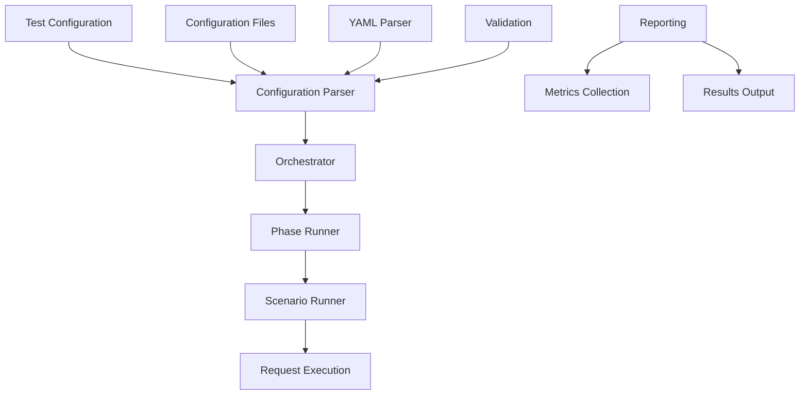

# Development Guide

This guide helps developers contribute to the Gradual stress testing framework.

## Development Environment Setup

### Prerequisites

- Python 3.9 or higher
- Git
- Make (optional, for using Makefile commands)

### Initial Setup

```bash
# Clone the repository
git clone https://github.com/Gradual-Load-Testing/gradual.git
cd gradual

# Create virtual environment
python -m venv .venv
source .venv/bin/activate  # On Windows: .venv\Scripts\activate

# Install development dependencies
pip install -e ".[dev]"

# Install pre-commit hooks
pre-commit install
```

### Development Dependencies

The project uses several development tools:

- **pytest**: Testing framework
- **black**: Code formatting
- **isort**: Import sorting
- **flake8**: Linting
- **mypy**: Type checking
- **pre-commit**: Git hooks

## Project Structure

```
gradual/
├── src/gradual/           # Main source code
│   ├── __init__.py        # Package initialization
│   ├── base/              # Base classes and interfaces
│   │   └── orchestrator.py # Main test orchestration
│   ├── configs/           # Configuration management
│   │   ├── parser.py      # Configuration parser
│   │   ├── phase.py       # Phase configuration
│   │   ├── request.py     # Request configuration
│   │   ├── scenario.py    # Scenario configuration
│   │   └── validate.py    # Configuration validation
│   ├── constants/         # Constants and enums
│   ├── exceptions.py      # Custom exceptions
│   ├── reporting/         # Reporting and metrics
│   └── runners/           # Test runners
│       ├── runner.py      # Main test runner
│       ├── phase.py       # Phase execution
│       ├── scenario.py    # Scenario execution
│       ├── session.py     # Session management
│       └── iterators.py   # Concurrency iterators
├── tests/                 # Test suite
├── docs/                  # Documentation
├── examples/              # Example configurations
├── benchmarks/            # Performance benchmarks
└── scripts/               # Utility scripts
```

## Code Style and Standards

### Python Style Guide

We follow PEP 8 with some modifications:

- **Line Length**: 88 characters (Black default)
- **Import Sorting**: isort with Black profile
- **Type Hints**: Required for public APIs

### Code Formatting

```bash
# Format code with Black
make format
# or
black src/ tests/

# Sort imports
make sort-imports
# or
isort src/ tests/
```

### Linting and Type Checking

```bash
# Run all quality checks
make quality

# Run specific checks
make lint      # flake8
make typecheck # mypy
make test      # pytest
```

## Testing

### Running Tests

```bash
# Run all tests
make test

# Run specific test files
pytest tests/test_runners.py

# Run with coverage
pytest --cov=src/gradual --cov-report=html

# Run performance tests
pytest tests/benchmarks/ -m "not slow"
```

### Writing Tests

Follow these guidelines:

1. **Test Structure**: Use descriptive test names and docstrings
2. **Fixtures**: Use pytest fixtures for common setup
3. **Mocking**: Mock external dependencies
4. **Coverage**: Aim for >90% code coverage

Example test:

```python
import pytest
from gradual.base.orchestrator import Orchestrator

class TestOrchestrator:
    """Test the orchestrator class."""
    
    def test_initialization(self):
        """Test orchestrator initialization with config paths."""
        test_config = "test_config.yaml"
        request_config = "request_config.yaml"
        orchestrator = Orchestrator(test_config, request_config)
        assert orchestrator.test_config_file_path == test_config
        assert orchestrator.request_configs_path == request_config
    
    def test_parser_initialization(self):
        """Test that parser is properly initialized."""
        orchestrator = Orchestrator("test.yaml", "request.yaml")
        assert orchestrator.parser is not None
```

## Architecture Overview

### Core Components



### Key Design Principles

1. **Extensibility**: Easy to add new test scenarios and phases
2. **Modularity**: Clear separation of concerns between phases, scenarios, and requests
3. **Performance**: Efficient resource usage with gevent-based concurrency
4. **Reliability**: Robust error handling and configuration validation

## Adding New Features

### 1. Configuration Extensions

To add new configuration options:

```python
from gradual.configs.parser import Parser

class ExtendedParser(Parser):
    """Extended parser with additional configuration options."""
    
    def __init__(self, test_config_file_path: str, request_configs_path: str):
        super().__init__(test_config_file_path, request_configs_path)
        # Add custom initialization logic
    
    def read_configs(self):
        """Read and parse all configuration files with extensions."""
        super().read_configs()
        # Add custom configuration parsing logic
```

### 2. Custom Runners

To add new runner types:

```python
from gradual.runners.runner import Runner

class CustomRunner(Runner):
    """Custom runner with additional functionality."""
    
    def __init__(self, scenarios):
        super().__init__(scenarios)
        # Initialize custom runner features
    
    def start_test(self):
        """Start test execution with custom logic."""
        # Add custom pre-execution logic
        super().start_test()
        # Add custom post-execution logic
```

### 3. Enhanced Reporting

To add new reporting features:

```python
from gradual.reporting.base import BaseReporter

class CustomReporter(BaseReporter):
    """Custom reporter implementation."""
    
    def __init__(self, config):
        super().__init__(config)
        # Initialize custom reporting features
    
    def generate_report(self, results):
        """Generate custom report format."""
        # Implementation here
        pass
```

## Configuration Management

### Configuration Schema

The framework uses a YAML-based configuration system:

```python
from gradual.configs.parser import Parser

class Parser:
    """Manages test configuration loading and validation."""
    
    def __init__(self, test_config_file_path: str, request_configs_path: str):
        self.test_config_file_path = test_config_file_path
        self.request_configs_path = request_configs_path
        self.phases = []
        self.run_name = None
        self.phase_wait = 0
    
    def read_configs(self):
        """Load and parse configuration files."""
        # Implementation here
        pass
```

### Configuration File Structure

The framework expects two main configuration files:

1. **Test Configuration**: Defines test phases, scenarios, and timing
2. **Request Configuration**: Defines individual HTTP and WebSocket requests and parameters

Example test configuration:

```yaml
runs:
  name: "example_test"
  wait_between_phases: 10
  phases:
    phase1:
      run_time: 300
      scenarios:
        scenario1:
          min_concurrency: 10
          max_concurrency: 100
          ramp_up_add: 10
          ramp_up_wait: 1
          requests: "FROM_REQUEST_YAML_FILE"
          request_file: "requests.yaml"
```

## Performance Considerations

### Memory Management

- Use generators for large datasets
- Implement proper cleanup in runners
- Monitor memory usage during tests

### Concurrency

- Leverage gevent for efficient I/O
- Use connection pooling where appropriate
- Implement rate limiting to prevent overwhelming targets

### Monitoring

```python
import psutil
import time

class PerformanceMonitor:
    """Monitor system performance during tests."""
    
    def __init__(self):
        self.start_time = time.time()
        self.start_memory = psutil.virtual_memory().used
    
    def get_stats(self):
        """Get current performance statistics."""
        current_memory = psutil.virtual_memory().used
        elapsed_time = time.time() - self.start_time
        
        return {
            "elapsed_time": elapsed_time,
            "memory_used": current_memory - self.start_memory,
            "cpu_percent": psutil.cpu_percent()
        }
```

## Documentation

### Code Documentation

- Use Google-style docstrings
- Include type hints for all public methods
- Document exceptions and edge cases

Example:

```python
def execute_test_scenario(self, scenario: dict, user_data: dict) -> dict:
    """Execute a test scenario with user data.
    
    Args:
        scenario: Scenario configuration dictionary
        user_data: User-specific data for the scenario
        
    Returns:
        Dictionary containing execution results
        
    Raises:
        ScenarioExecutionError: If scenario execution fails
        ValidationError: If response validation fails
    """
    pass
```

### API Documentation

- Keep API documentation up to date
- Include usage examples
- Document breaking changes

## Contributing Guidelines

### Pull Request Process

1. **Fork** the repository
2. **Create** a feature branch
3. **Make** your changes
4. **Test** thoroughly
5. **Update** documentation
6. **Submit** a pull request

### Commit Messages

Use conventional commit format:

```
feat: add custom runner support
fix: resolve memory leak in connection pooling
docs: update API documentation
test: add performance benchmarks
```

### Code Review

- All changes require review
- Address feedback promptly
- Maintain test coverage
- Follow project standards

## Debugging and Troubleshooting

### Development Tools

```bash
# Enable debug logging
export GRADUAL_LOG_LEVEL="DEBUG"

# Run with profiling
python -m cProfile -o profile.stats stress_run.py

# Analyze profile results
python -c "import pstats; p = pstats.Stats('profile.stats'); p.sort_stats('cumulative').print_stats(20)"
```

### Common Issues

1. **Import Errors**: Check PYTHONPATH and virtual environment
2. **Configuration Issues**: Validate YAML syntax and schema
3. **Performance Problems**: Use profiling tools to identify bottlenecks
4. **Memory Issues**: Monitor memory usage and implement cleanup

## Release Process

### Version Management

- Use semantic versioning (MAJOR.MINOR.PATCH)
- Update version in `pyproject.toml`
- Create release notes
- Tag releases in Git

### Distribution

```bash
# Build package
make build

# Test installation
pip install dist/*.whl

# Upload to PyPI (maintainers only)
make publish
```

## Getting Help

- **Issues**: GitHub Issues for bugs and feature requests
- **Discussions**: GitHub Discussions for questions and ideas
- **Documentation**: This guide and API reference
- **Code**: Source code and examples

## Next Steps

- Read the [API Reference](api/) for detailed technical information
- Check out [Examples](examples.md) for usage patterns
- Review the [User Guide](user_guide.md) for end-user documentation
- Join the [community discussions](https://github.com/Gradual-Load-Testing/gradual/discussions)
