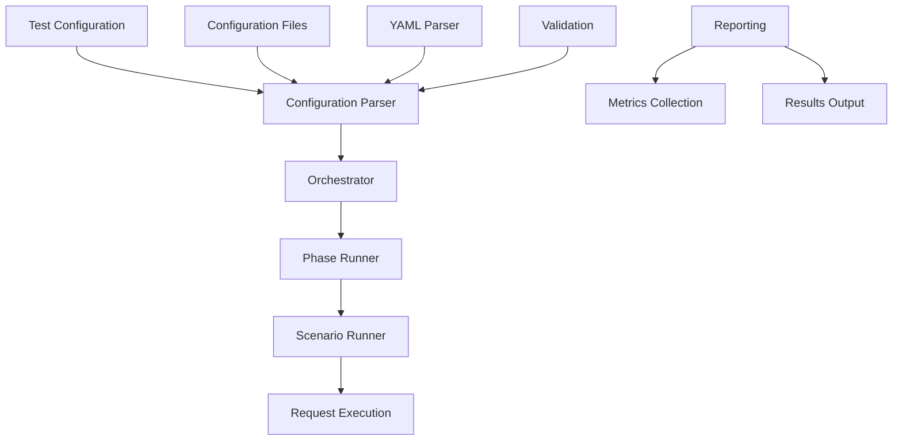

# Welcome to Gradual

A comprehensive Python stress testing framework for applications and systems.

## What is Gradual?

Gradual is a powerful, extensible stress testing framework designed to help developers and DevOps engineers validate the performance and reliability of their applications under various load conditions. Built with Python, it provides a flexible and intuitive way to create, execute, and analyze stress tests.

## Key Features

- **🚀 High Performance**: Built on gevent for efficient concurrency
- **🔌 Protocol Support**: HTTP, WebSocket, and custom protocol support
- **📊 Real-time Monitoring**: Live dashboard with Bokeh visualizations
- **📈 Comprehensive Metrics**: Detailed performance analytics and reporting
- **🔐 Authentication**: Support for Kerberos, NTLM, OAuth, and more
- **🌐 Distributed Testing**: Scale tests across multiple machines
- **📝 YAML Configuration**: Simple, declarative test configuration
- **🎯 CLI Interface**: Easy-to-use command-line tools

## Quick Start

```bash
# Install Gradual
pip install -e ".[dev,bokeh,websockets]"

# Run a stress test
stress-run --test_config examples/api_test.yaml --request_config examples/requests.yaml

# Start the monitoring dashboard
stress-dashboard --mode bokeh
```

## Architecture Overview




## Documentation Sections

- **[Quick Start Guide](quick_start.md)**: Get up and running in minutes
- **[User Guide](user_guide.md)**: Learn how to use Gradual for stress testing
- **[Configuration Reference](configuration_reference.md)**: Complete configuration options and examples
- **[Development Guide](dev_guide.md)**: Contribute to the framework development
- **[API Reference](api/)**: Complete API documentation
- **[Examples](examples.md)**: Real-world usage examples
- **[Contributing](contributing.md)**: How to contribute to the project

> **💡 New!** The **Configuration** tab in the navigation provides a dedicated reference for all configuration options, examples, and best practices.

## Getting Help

- 📖 **Documentation**: This site contains comprehensive guides
- 🐛 **Issues**: Report bugs on [GitHub Issues](https://github.com/Gradual-Load-Testing/gradual/issues)
- 💬 **Discussions**: Join the conversation on [GitHub Discussions](https://github.com/Gradual-Load-Testing/gradual/discussions)
- 📧 **Contact**: Reach out to the maintainers

## License

Gradual is licensed under the MIT License. See the [LICENSE](../LICENSE) file for details.
